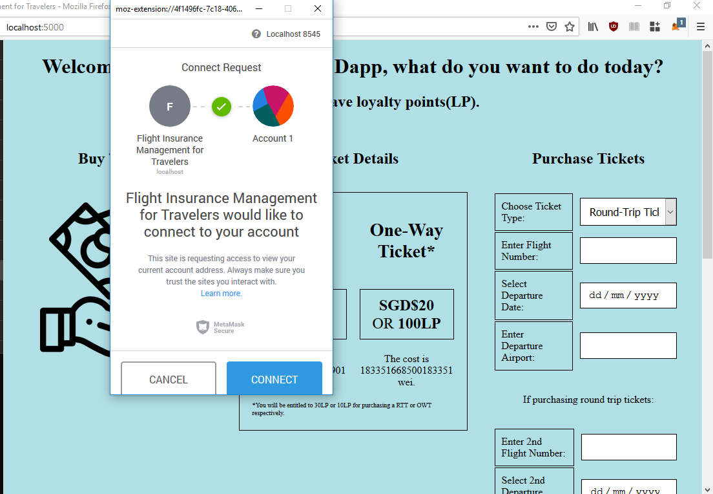
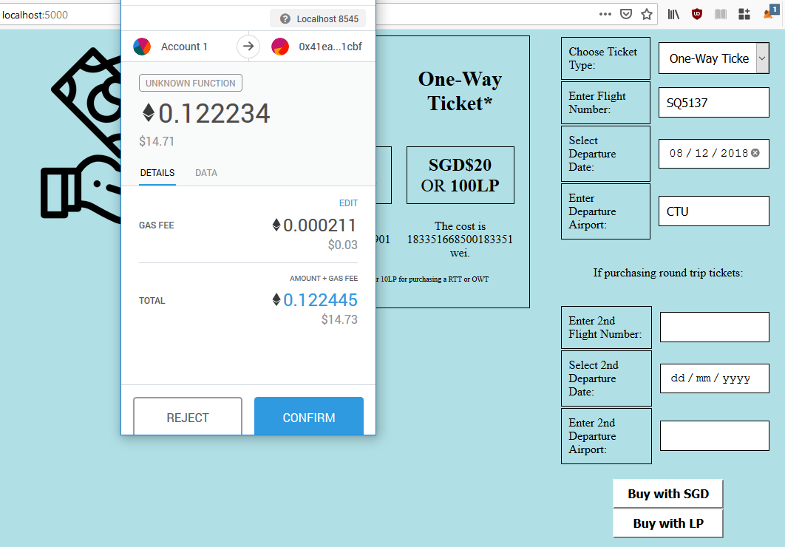
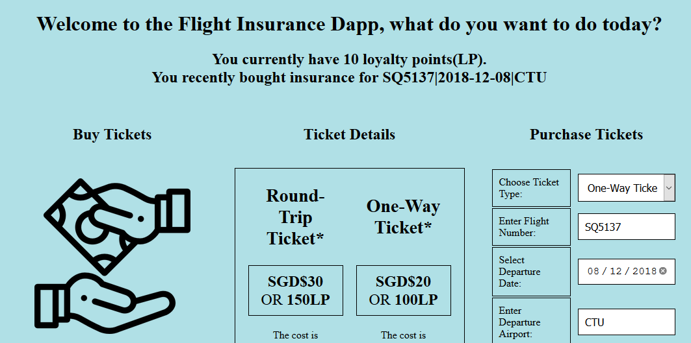
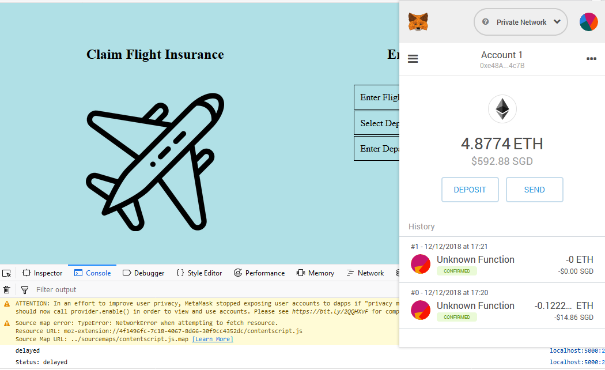
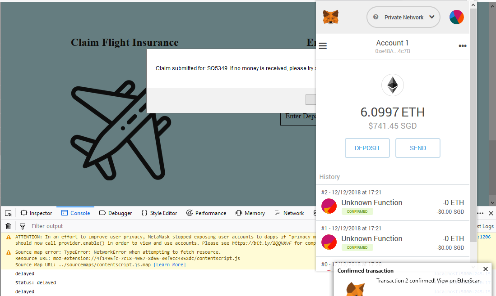
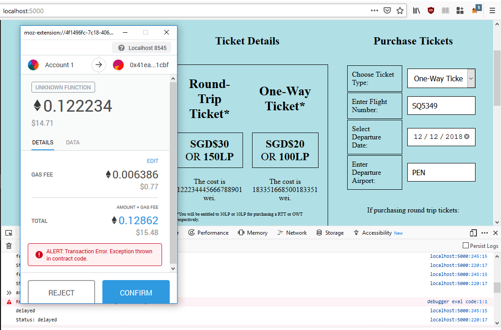

# To run
1. Change `myAddress` variable in `flightdelayserver.py` to our Metamask's address.

    This is only used so that we would have some money in our wallet in Metamask.

2. Start Ganache or geth
    
    *If using a testnet with oraclize, we can use the commented part of* `converter.sol`

3. Run `flightdelayserver.py`
4. Navigate to `localhost:5000`

    If there is an error with account nonce, reset the Metamask account by navigating to `Settings` --> `Reset Account` 

# Parts
## Server
`flightdelayserver.py` handles the deploying and initialisation of the contracts we are using. 

Located at `/` is `mainpage.html`. It is where the user interacts with the contract. 

There is another part at `/sia_query`. It hosts our API that connects to SIA's API and parses the response.
* When `/sia_query` receives an API call (POST request), it would format and send an API call to SIA's API.
* It then sends the updated status of the flight to `FlightDetails.sol`.

## flightdelay.sol
This is our main contract. Most of the code executed by the front-end is for this contract.

This contract handles the
* List of users, their purchased tickets and loyalty points
* Purchase of tickets
* Sending of claims

This contract will call other contracts for 
* Update of the conversion rate
* Statuses of flights
* Checking amount users are eligible to claim

## FlightDetails.sol
This contract handles the flight details. It stores the status of flights. 

`flightdelay.sol` can call this contract to check how much a user is eligible to claim.

The `sia_query` API in our server mainly talks to this contract. 

We are able to give other servers/users the rights to update of the status of flights.

## converter.sol
This contract handles methods concerning the exchange rate.

If we are using Ropsten or other networks that support oraclize, we should use the commented-out part below.
It uses the oraclize API to query an external server at cryptocompare.com for the exchange rate.

## mainpage.html
This page contains all our front-end code.

It asks to allow MetaMask on this page.

After a user purchases a ticket, the most recently bought ticket would be shown at the top.

# Notes/Analysis
* **Currently, only SQ flights are accepted**

* Storage of users is done by having a triple nested mapping which is more efficient than iterating through lists of users and structs.

* SIA API is done externally instead of using oraclize. 
    - \- requires the user to trust the server querying the API
    - \+ much cheaper to parse strings outside solidity/EVM
    - \+ our API key is hidden

* Function `claimMoney` in `flightdelay.sol` has update changes before `.transfer` to prevent malicious callback functions

* When claiming a delayed flight, we query an external API and update our contract. The return of money might be delayed, and the user might need to resend the query. 

# Screenshots

_Access prompt when we first start connecting_

_Purchasing a ticket_

_Confirmation of purchase and updated loyalty points._

_Amount of ether pre claim, we can see that the flight is delayed from the console_

_After submitting the claim again, we receive our money_

_The contract prevents purchase of already delayed or cancelled flights_

